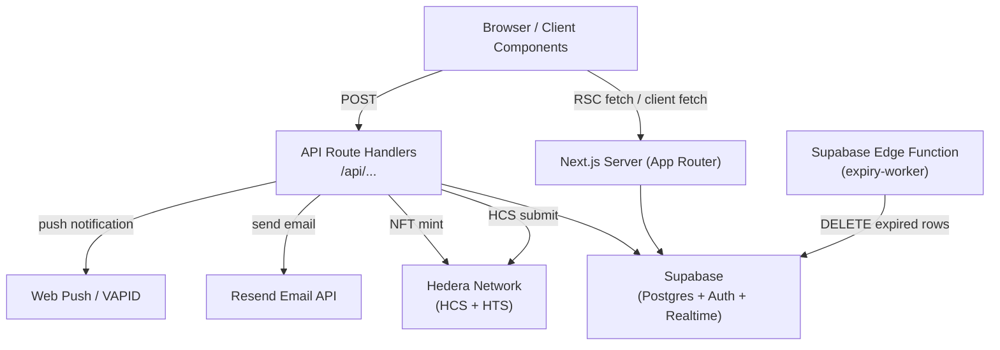

# Design Document: Argentum Refinements

## Overview

This document covers the technical design for all 20 requirements across six feature areas: Blockchain/Proof of Build (Req 1–3), Collab Feature (Req 4–5), Disappearing Messages (Req 6–7), Admin Panel completion (Req 8–11), Bug Fixes (Req 12–17), and Tests & Error Handling (Req 18–20).

The app is a Next.js 16 App Router application backed by Supabase (PostgreSQL + Auth + Realtime). All new server-side logic lives in API route handlers or Supabase Edge Functions. Client components use the existing `createClient()` pattern from `src/lib/supabase/client.ts`.

---

## Architecture



### Key Architectural Decisions

- **HCS/NFT work happens in API routes**, not in client components, to keep Hedera credentials server-side only.
- **Collab requests** use a new `collab_requests` table; the existing `posts.is_collab` flag is already in the schema.
- **Disappearing message cleanup** runs as a Supabase Edge Function on a cron schedule (pg_cron or Supabase scheduled functions).
- **Feed caching** switches from `force-dynamic` to ISR (`revalidate = 60`) with explicit `revalidatePath` calls on post creation.
- **Error boundaries** use Next.js 13+ `error.tsx` / `global-error.tsx` conventions.

---

## Components and Interfaces

### Req 1–3: Blockchain / Proof of Build

#### `src/lib/hedera/hcs.ts` — HCS Client
```ts
export async function submitToHCS(payload: {
  postId: string
  userId: string
  contentHash: string
}): Promise<{ sequenceNumber: number }>
```
Uses the `@hashgraph/sdk` package. Reads `HEDERA_OPERATOR_ID`, `HEDERA_OPERATOR_KEY`, `HEDERA_TOPIC_ID` from env. Implements retry with exponential backoff (up to 3 attempts).

#### `src/lib/hedera/nft.ts` — NFT Minter
```ts
export async function mintBuildNFT(payload: {
  postId: string
  contentHash: string
  recipientWallet: string | null
}): Promise<{ tokenId: string }>
```
Mints on Hedera Token Service. Falls back to treasury account when `recipientWallet` is null.

#### `src/app/api/blockchain/submit/route.ts` — POST endpoint
Called after post creation. Orchestrates HCS submission → DB update → NFT mint trigger.

#### `src/components/VerificationBadge.tsx` — Verification UI
Displays on `src/app/post/[id]/page.tsx`. Shows HCS sequence number, NFT token ID, content hash (truncated + copy button), verified_at, and Hashscan links. Handles all three `verification_status` states.

---

### Req 4–5: Collab Feature

#### `src/app/api/collab/apply/route.ts` — POST
Inserts into `collab_requests`, creates notification, enforces duplicate prevention.

#### `src/app/api/collab/respond/route.ts` — PATCH
Accepts/declines a request, creates notification for applicant.

#### `src/components/CollabApplyButton.tsx`
Shown on post cards and post detail pages when `post.is_collab = true` and viewer is not the author. Displays "Apply", "Application Pending", or "Accepted" based on existing request state.

#### `src/components/CollabRequestsPanel.tsx`
Shown to post authors on their own collab posts. Lists pending requests with accept/decline actions and a "Message" button that navigates to `/messages` with the collaborator pre-selected.

---

### Req 6–7: Disappearing Messages

#### `src/components/DisappearingMessageSettings.tsx`
Dropdown in the conversation settings panel. Calls `PATCH /api/messages/settings` to update `conversations.disappearing_messages`. Inserts a system message on change.

#### `src/components/MessageExpiryIndicator.tsx`
Renders a countdown badge on messages with `expires_at` set. Uses a `useEffect` interval to check expiry client-side and replace content with "This message has expired."

#### `supabase/functions/expiry-worker/index.ts` — Edge Function
Runs on a cron schedule (every 60 min). Deletes rows from `messages` where `expires_at < NOW()`. Logs count and timestamp.

---

### Req 8–11: Admin Panel

#### Posts page enhancements (`src/app/admin-b2ce13e04e810c06/posts/page.tsx`)
- Add `verification_status` filter buttons alongside existing category filter.
- Add full-text search across `title` and `content` (using Postgres `ilike` on both fields).
- Display `content_hash` (truncated) and `hcs_sequence_num` in each post card.
- Fix "Verify" action to set `verified_at` and use action name `admin_verify_post`.

#### Reports page enhancements (`src/app/admin-b2ce13e04e810c06/reports/page.tsx`)
- Display severity, reason, details, reporter, target, and timestamp (already partially implemented).
- Add "resolved" filter tab.
- Ensure audit log entries use correct action names per requirements.

#### Audit log enhancements (`src/app/admin-b2ce13e04e810c06/audit/page.tsx`)
- Already has pagination and search. Add IP address column (already in schema as `ip_address`).
- Ensure total count display is wired up.

#### Status broadcasts (`src/app/admin-b2ce13e04e810c06/status/UpdatesClient.tsx`)
- Wire up the broadcast form to call `/api/admin/broadcast-update` with CSRF token.
- Display success count or error message after submission.
- Handle missing `RESEND_API_KEY` gracefully.

---

### Req 12–17: Bug Fixes

#### OG Image (`public/og-image.png`)
Add a 1200×630 PNG. The metadata in `src/app/layout.tsx` already references `/og-image.png`.

#### Message Reactions UI
The `toggleReaction` function already exists in the conversation page. The missing piece is the emoji picker UI triggered on hover/long-press, and the grouped reaction display below messages. Add `src/components/EmojiPicker.tsx` (inline, no external library needed — 6 hardcoded emoji options) and `src/components/ReactionDisplay.tsx`.

#### Push Notifications VAPID
The `/api/webpush/route.ts` already has the correct VAPID guard. The missing piece is the client-side subscription registration. Add `src/lib/push/subscribe.ts` that reads `NEXT_PUBLIC_VAPID_PUBLIC_KEY` and registers the service worker subscription, then POSTs to `/api/webpush/subscribe`.

Add `src/app/api/webpush/subscribe/route.ts` to handle subscription storage.

The `public/sw.js` service worker needs a `push` event handler.

#### Placeholder Pages
Rewrite `src/app/brand/page.tsx`, `src/app/privacy/page.tsx`, and `src/app/terms/page.tsx` with real content. Remove any `force-dynamic` exports.

#### Feed Caching
Replace `export const dynamic = 'force-dynamic'` in `src/app/feed/page.tsx` with `export const revalidate = 60`. Add `revalidatePath('/feed')` call in the post creation API route. Cache the trending tags query separately with `revalidate = 300`.

#### Image Optimization
Update `next.config.ts` with `images.remotePatterns` for Supabase storage, GitHub avatars, and Google avatars. Update `images.formats` to `['image/avif', 'image/webp']`. Replace `` tags in `PostCard`, `Navbar`, and `MessagesClient` with Next.js `<Image>`. Add initials fallback component.

---

### Req 18–20: Tests & Error Handling

#### Unit Tests (`src/lib/__tests__/`)
- `crypto.test.ts` — round-trip property for encrypt/decrypt
- `hash.test.ts` — idempotence property for `hashContent`
- `streak.test.ts` — consecutive, broken, empty streak cases
- `time.test.ts` — relative time formatting cases

#### E2E Tests (`e2e/`)
- `auth.spec.ts` — login flow
- `post.spec.ts` — create post and verify feed appearance
- `admin.spec.ts` — admin panel access control

#### Error Boundaries
- `src/app/error.tsx` — catches route-level errors, shows recovery UI
- `src/app/global-error.tsx` — catches root layout errors

---

## Data Models

### New Table: `collab_requests`

```sql
CREATE TABLE collab_requests (
  id          uuid PRIMARY KEY DEFAULT gen_random_uuid(),
  post_id     uuid NOT NULL REFERENCES posts(id) ON DELETE CASCADE,
  applicant_id uuid NOT NULL REFERENCES users(id) ON DELETE CASCADE,
  message     text,
  status      text NOT NULL DEFAULT 'pending'
              CHECK (status IN ('pending', 'accepted', 'declined')),
  created_at  timestamptz NOT NULL DEFAULT now(),
  UNIQUE (post_id, applicant_id)
);
```

### New Table: `reports`

The existing `issue_reports` table is for bug reports. Content moderation reports need a separate table:

```sql
CREATE TABLE reports (
  id               uuid PRIMARY KEY DEFAULT gen_random_uuid(),
  reporter_id      uuid NOT NULL REFERENCES users(id) ON DELETE CASCADE,
  target_post_id   uuid REFERENCES posts(id) ON DELETE SET NULL,
  target_user_id   uuid REFERENCES users(id) ON DELETE SET NULL,
  reason           text NOT NULL,
  details          text,
  severity         text NOT NULL DEFAULT 'medium'
                   CHECK (severity IN ('low', 'medium', 'high')),
  status           text NOT NULL DEFAULT 'pending'
                   CHECK (status IN ('pending', 'resolved')),
  resolution       text CHECK (resolution IN ('dismissed', 'taken_action')),
  resolved_at      timestamptz,
  created_at       timestamptz NOT NULL DEFAULT now()
);
```

### Schema Updates

**`admin_audit_log`** — add `ip_address` column (already referenced in UI):
```sql
ALTER TABLE admin_audit_log ADD COLUMN IF NOT EXISTS ip_address text;
```

**`notifications`** — add `'collab_request'` to the type enum:
```sql
ALTER TYPE notification_type ADD VALUE IF NOT EXISTS 'collab_request';
```
(Or update the check constraint if using a check constraint instead of an enum.)

**`database.ts` type updates** — add `collab_requests` and `reports` table types, update `notifications.type` union.

### Existing Schema (relevant fields already present)

| Table | Field | Used by |
|---|---|---|
| `posts` | `content_hash`, `hcs_sequence_num`, `nft_token_id`, `verification_status`, `verified_at`, `is_collab` | Req 1–4 |
| `conversations` | `disappearing_messages` | Req 6 |
| `messages` | `expires_at` | Req 6–7 |
| `message_reactions` | `message_id`, `user_id`, `emoji` | Req 13 |
| `push_subscriptions` | `user_id`, `subscription` | Req 14 |
| `admin_audit_log` | `admin_id`, `action`, `target_type`, `target_id` | Req 8–10 |
| `users` | `hbar_wallet` | Req 2 |

---

## Correctness Properties

*A property is a characteristic or behavior that should hold true across all valid executions of a system — essentially, a formal statement about what the system should do. Properties serve as the bridge between human-readable specifications and machine-verifiable correctness guarantees.*

### Property 1: Encryption Round Trip

*For any* valid plaintext string, sender key pair, and recipient key pair, encrypting the plaintext with the recipient's public key and then decrypting with the recipient's secret key SHALL return the original plaintext.

**Validates: Requirements 18.1**

---

### Property 2: Hash Idempotence

*For any* string input, calling `hashContent` twice with the same input SHALL produce identical output strings.

**Validates: Requirements 18.2**

---

### Property 3: Collab Request Uniqueness

*For any* `(post_id, applicant_id)` pair, submitting a collaboration application SHALL result in exactly one `collab_requests` record — a second submission SHALL be rejected and the record count SHALL remain one.

**Validates: Requirements 4.3**

---

### Property 4: Disappearing Message Expiry Invariant

*For any* message with a non-null `expires_at` value in the past, after the Expiry_Worker runs, that message SHALL NOT exist in the `messages` table.

**Validates: Requirements 7.1, 7.2**

---

### Property 5: Verification Status Monotonicity

*For any* post, once `verification_status` is set to `'verified'`, subsequent HCS or admin operations SHALL NOT revert it to `'unverified'` without an explicit admin action.

**Validates: Requirements 1.6, 8.2**

---

### Property 6: Audit Log Completeness

*For any* admin action performed through the Admin_Panel, an `admin_audit_log` record SHALL exist with a matching `action`, `target_type`, and `target_id`.

**Validates: Requirements 8.2, 8.3, 9.2, 9.3, 10.5**

---

### Property 7: Push Subscription Stale Cleanup

*For any* push subscription that returns a 410 or 404 status during a send attempt, that subscription record SHALL be deleted from `push_subscriptions` and SHALL NOT be used in subsequent send attempts.

**Validates: Requirements 14.5**

---

### Property 8: Feed Cache Freshness

*For any* post published after a feed cache invalidation, the feed page SHALL include that post within 60 seconds of publication.

**Validates: Requirements 16.1, 16.2**

---

### Property 9: Reaction Toggle Idempotence

*For any* `(message_id, user_id, emoji)` triple, toggling the same reaction twice SHALL result in no net change to the `message_reactions` table — the record SHALL be absent after an even number of toggles and present after an odd number.

**Validates: Requirements 13.3**

---

### Property 10: Message Formatting Completeness

*For any* message with a sender and a `created_at` timestamp, the formatted message display SHALL contain both the sender identifier and a human-readable timestamp string.

**Validates: Requirements 18.4**

---

## Error Handling

### HCS Submission Failures (Req 1.3)
Retry up to 3 times with exponential backoff (1s, 2s, 4s). On final failure, set `verification_status = 'unverified'` and log the error with `console.error`. Do not throw to the client — return a 200 with `{ status: 'unverified', error: message }`.

### NFT Minting Failures (Req 2.3)
Log the error and leave `nft_token_id = null`. Do not revert `verification_status`. The post remains verified even if NFT minting fails.

### Missing VAPID Keys (Req 14.2)
Return HTTP 500 with `{ error: 'VAPID keys not configured on server' }`. Guard is already in `/api/webpush/route.ts`.

### Missing RESEND_API_KEY (Req 11.5)
Return HTTP 500 with `{ error: 'Email service not configured' }` before attempting any Resend calls.

### Expiry Worker DB Errors (Req 7.5)
Catch the error, log it with timestamp and error message, and exit the function without performing partial deletes. Use a transaction to ensure atomicity.

### Error Boundaries (Req 20)
- `src/app/error.tsx`: catches errors in route segments. Displays logo, human-readable message, "Try Again" button (calls `reset()`), and a link to `/feed`.
- `src/app/global-error.tsx`: catches errors in the root layout itself. Must include `<html>` and `<body>` tags. Same recovery UI.
- In development: log full stack to console. In production: log structured JSON `{ message, stack, timestamp }` to console (can be picked up by Vercel log drains).

### Image Load Failures (Req 17.5)
`<Image>` components use an `onError` handler that sets a local state flag, switching to an initials-based fallback `<div>`.

---

## Testing Strategy

### Unit Tests (Vitest)

**Framework**: Vitest with `vitest.config.ts` at the project root.

**Files to create**:
- `src/lib/__tests__/crypto.test.ts`
- `src/lib/__tests__/hash.test.ts`
- `src/lib/__tests__/streak.test.ts`
- `src/lib/__tests__/time.test.ts`

**Approach**: Use `@fast-check/vitest` for property-based tests. Each property test runs a minimum of 100 iterations.

**Property test tag format**: `// Feature: argentum-refinements, Property {N}: {property_text}`

Unit tests focus on:
- Specific examples for streak edge cases (empty history, single day, broken streak)
- Specific examples for time formatting (seconds, minutes, hours, days)
- Property tests for crypto round-trip and hash idempotence

Avoid testing implementation details of Supabase queries in unit tests — those are covered by E2E tests.

### E2E Tests (Playwright)

**Framework**: Playwright with `playwright.config.ts` at the project root.

**Files to create**:
- `e2e/auth.spec.ts` — login → redirect to `/feed`
- `e2e/post.spec.ts` — create post → appears on feed
- `e2e/admin.spec.ts` — non-admin cannot access admin panel

**Configuration**: Tests run against `http://localhost:3000` using `NEXT_PUBLIC_SUPABASE_URL` and `NEXT_PUBLIC_SUPABASE_ANON_KEY` from `.env`.

**Property test configuration**: Each property-based unit test uses `fc.assert(fc.property(...), { numRuns: 100 })`.

### Dual Testing Rationale

Unit tests catch concrete bugs in pure functions (crypto, hashing, time formatting, streak calculation). Property tests verify universal correctness guarantees that hold across all valid inputs. E2E tests verify that the integrated system works from the user's perspective. All three layers are necessary — unit tests are fast and precise, property tests find edge cases that examples miss, and E2E tests catch integration failures.
